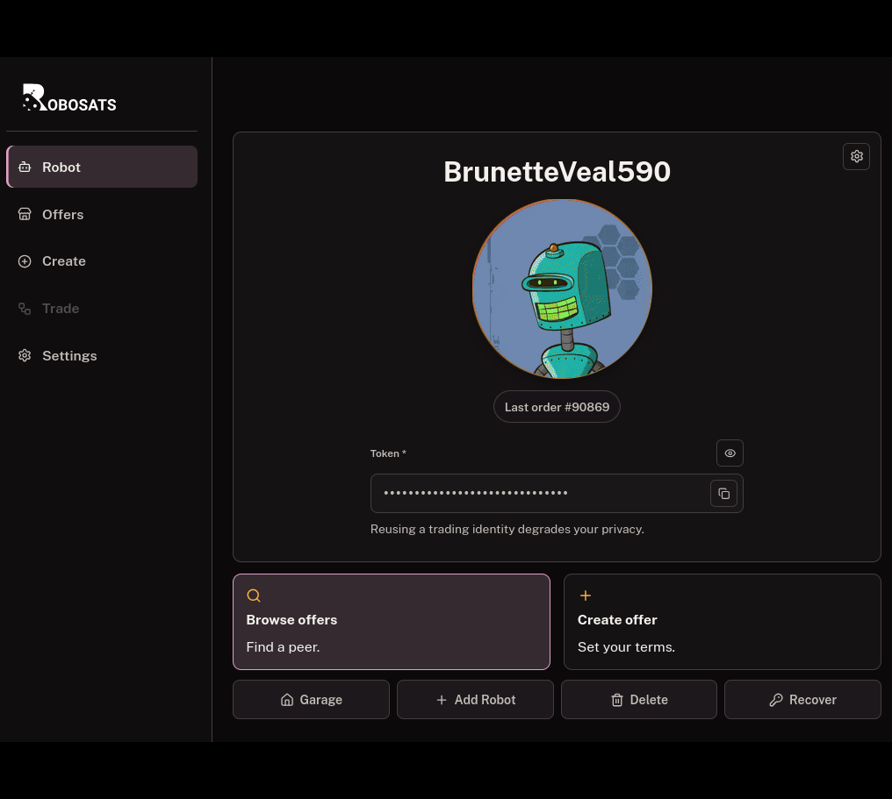

# RoboSats Experimental Frontend

Experimental RoboSats client for web, Android, and iOS. The frontend uses
React, TypeScript, Vite, Nostr orderbook transport, encrypted trade chat, and
the current RoboSats coordinator API. The mobile packages embed Arti and route
all coordinator traffic through a local SOCKS proxy.

**Live Client (Tor Hidden Service)**:

[**http://roboexpaotkiicp3rktwo6a5g2rlnmjub44mu7k4hrhcfxaxqmr63wyd.onion**](http://roboexpaotkiicp3rktwo6a5g2rlnmjub44mu7k4hrhcfxaxqmr63wyd.onion)

<p align="center">
  
</p>

RoboSats Exp. is alpha software. Review the release notes and verify published
checksums before installing a binary.

## Install dependencies

Run commands from the repository root:

```bash
npm ci
```

Use `npm ci` for reproducible builds from `package-lock.json`. Platform builds
also require the Android or iOS tools listed below.

## Development

```bash
npm run dev
```

The development server prints its local URL. It exposes source modules and
debugging tools and must not be placed behind a public onion service.

## Build targets

### Production web bundle

Build the deployable static application:

```bash
npm run build
```

Output:

```text
dist/
```

The command runs TypeScript validation before Vite and exits without producing
a successful build when validation fails. The resulting `dist/` directory is a
complete static SPA and must be deployed as a unit; do not copy individual
hashed files from it.

### Local Nginx deployment

Build and atomically deploy the production web bundle to
`/srv/robosats-exp`:

```bash
npm run build:nginx
```

This command requires `sudo` access, validates the Nginx configuration, and
reloads Nginx after deployment. Set `ROBOSATS_NGINX_ROOT` to use another
document root:

```bash
ROBOSATS_NGINX_ROOT=/srv/another-root npm run build:nginx
```

The deployment script installs files only. Configure the Nginx virtual host
and Tor hidden-service mapping separately. Production assets are namespaced by
source revision, and the atomic deployment retains one previous asset
generation so clients loading through Tor are not stranded during a release.

### Android APKs

Additional requirements:

- Java 17
- Android SDK 36 and build tools 36
- Android NDK `27.0.12077973`
- Rustup
- `cargo-ndk`

Install `cargo-ndk` once if it is not already available:

```bash
cargo install cargo-ndk --version 4.1.2 --locked
```

Build debug APKs:

```bash
npm run build:android:debug
```

Outputs:

```text
android/app/build/outputs/apk/debug/robosats-exp-arm64-v8a-debug.apk
android/app/build/outputs/apk/debug/robosats-exp-x86_64-debug.apk
android/app/build/outputs/apk/debug/robosats-exp-universal-debug.apk
```

Build release APKs:

```bash
npm run build:android:release
```

Outputs are written under `android/app/build/outputs/apk/release/`.

Both commands rebuild the frontend and native Rust libraries, package them,
and run the Android 16 KB ELF alignment check. See
[ANDROID_BUILD.md](ANDROID_BUILD.md) for the native build and network boundary.

### iOS unsigned IPA on Linux

The Linux build requires Swift 6.3, Rustup, xtool 1.17 or newer, and an Xcode
26 `.xip` whose Darwin SDK has been registered with xtool:

```bash
xtool sdk install /path/to/Xcode.xip
swift sdk list
npm run build:ios:unsigned:linux
```

`swift sdk list` must include `darwin`. Output:

```text
ios/build/RoboSatsExp-unsigned.ipa
```

The command builds the web bundle, cross-compiles embedded Arti for
`arm64-apple-ios`, builds the SwiftPM application with xtool, and verifies that
the IPA is unsigned and contains an ARM64 Mach-O executable.

### iOS unsigned IPA on macOS

The macOS build requires current Xcode command-line tools, XcodeGen, and
Rustup:

```bash
npm run build:ios:unsigned
```

Output:

```text
ios/build/RoboSatsExp-unsigned.ipa
```

The command generates the Xcode project, builds the frontend and embedded Arti
library, disables code signing, and packages the application. Both iOS paths
share the same source and build metadata. See [ios/README.md](ios/README.md)
for xtool installation, SDK storage, version synchronization, and diagnostics.

## Verification

Run the repository checks independently with:

```bash
npm run typecheck
npm run check:typography
npm test
npm run build
npm run check:production-build
npm audit --audit-level=high
```

`npm run check:production-build` verifies that development-only modules were
not emitted. Use `VITE_ROBOSATS_API_BASE_URL` when local development needs a
separate coordinator backend.

## Design

The active semantic color and accessibility rules are documented in
[docs/color-system.md](docs/color-system.md) and
[docs/typography-system.md](docs/typography-system.md).

Public Sans is distributed under the SIL Open Font License 1.1. Its complete
notice is bundled at `static/licenses/PublicSans-OFL.txt`.

## Contributing and releases

See [CONTRIBUTING.md](CONTRIBUTING.md) for development requirements,
[SECURITY.md](SECURITY.md) for private vulnerability reporting, and
[docs/releasing.md](docs/releasing.md) for versioning, Android packaging, iOS
packaging, and the GitHub release process.

This project is distributed under the GNU Affero General Public License v3.0.
