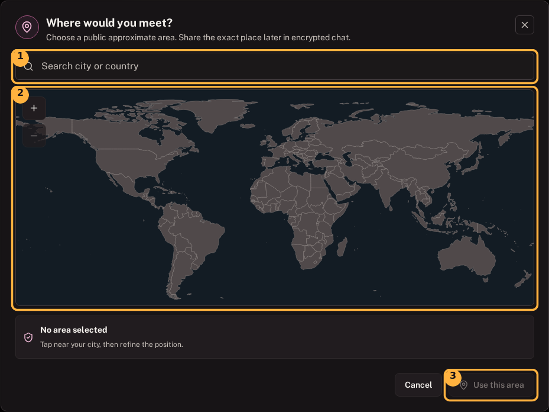
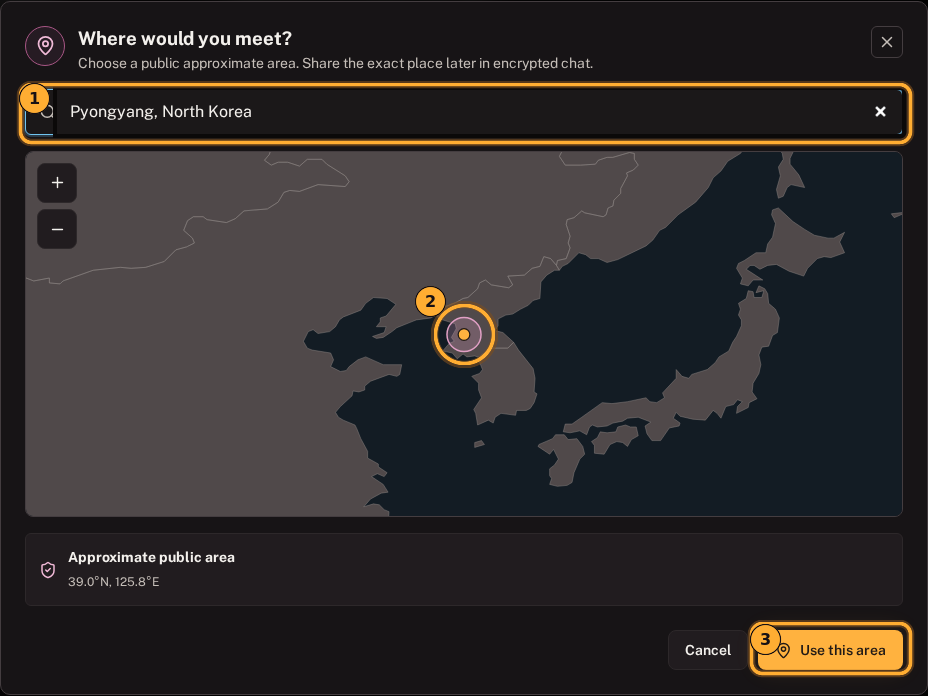

# Cash F2F map guide

[Guide home](README.md) | [Standard Garage](standard-garage-guide.md) | [Pro Mode](pro-mode-guide.md) | **Cash F2F map**

A face-to-face cash trade needs a location. A public orderbook does not need your exact bench, cafe, home, or office.

RoboSats Exp. separates the location into two stages:

1. Publish an **approximate public area** with the offer.
2. Agree on the **exact public venue and time** later in encrypted trade chat.

## What remains private

| Public with the offer | Reserved for encrypted chat |
| --- | --- |
| Approximate area | Exact venue |
| Buy/sell direction | Meeting time |
| Amount or range | Recognition details |
| Premium and payment method | Any necessary contact detail |

The public approximation is still information about you. Choose a broad, busy district or town area, never a home or sensitive address.

## How the private map works

- It does not request device location.
- Country boundaries and city search data ship with the client.
- It does not contact Google Maps, OpenStreetMap tile servers, or another map service.
- The chosen point is reduced to an approximate public area before publication.
- Antarctica is excluded from the useful viewport so inhabited regions remain readable.

## Create a Cash F2F offer

1. Open **Create**.
2. Select **Buy BTC** or **Sell BTC**.
3. Enter the amount or range.
4. Add **Cash F2F** as a payment method.
5. Select **Choose area**.

Look for three controls:

1. **Search city or country** for a quick starting position.
2. The map itself for pan, zoom, and direct selection.
3. **Use this area**, which remains unavailable until an area is selected.

No point is published merely by opening this dialog.

## Choose an approximate area

### Search first

Type at least two characters, then select a city or country result. The bundled index includes major population centers and additional cities relevant to bitcoin communities and circular economies.

Check:

1. The search field contains the intended city.
2. The marker is in a broad, sensible public area.
3. **Use this area** is available only after selection.

The marker is an approximation, not a promise to meet at that exact coordinate.

### Or navigate manually

- Click or tap near the intended area.
- Drag to pan.
- Use **+** and **-** to zoom.
- Use the mouse wheel on desktop.
- Pinch with two fingers on touch devices.
- With keyboard focus on the map, use arrow keys to pan and Enter to select.

Select **Use this area** when the public approximation is acceptable.

**You should now see:** **Area selected** beside the Cash F2F payment method in the offer form.

## Review before publishing

Verify:

- Buy/sell direction.
- Fiat amount or range.
- Premium and bond.
- Coordinator.
- Approximate area.
- Description contains no exact address or personal contact detail.

An offer preset can remember Cash F2F as a method, but reconsider the area every time. A previous area may no longer be appropriate.

## Find current Cash F2F offers

When public Cash F2F offers contain map coordinates, **Offers** exposes a compact map action.

The map can show:

- Approximate areas with offers.
- Buy, sell, or mixed markers.
- A count where several offers share an area.
- A selectable offer list for the chosen area.

Select an area, review an offer, and close its review to return to the map. This lets you compare nearby offers without losing the map.

Older coordinator versions may publish Cash F2F offers without coordinates. Those remain in the normal orderbook even when they cannot appear on the map.

## Agree on the real meeting

Wait until encrypted trade chat is open. Then agree on:

- A specific busy public venue.
- Date and time.
- A minimal way to recognize one another.
- How cash will be counted and authenticated.
- What happens if either person is late.

Do not place these details in the public offer description.

## Personal-safety checklist

- [ ] Busy, neutral, public venue.
- [ ] No home, hotel room, vehicle, or isolated area.
- [ ] Venue opening hours and phone reception checked.
- [ ] No more cash carried than agreed.
- [ ] Cash counted and authenticated before escrow release.
- [ ] Protocol not bypassed because of urgency or pressure.
- [ ] Willing to leave if the person or situation differs materially.
- [ ] Local laws and personal-safety guidance followed.

## Troubleshooting

### The map is loading

The map is a lazy-loaded local asset. Keep the dialog open while **Loading private map** is shown. The first load over Tor can take a moment.

### The map failed to open

Retry once. A deployed web client must include its complete versioned `static/` directory. Do not publish until **Area selected** is visible.

### City search cannot find my place

The bundled index is a convenience, not an exhaustive gazetteer. Pan and zoom manually, then select a broad area.

The offer stores the selected approximation, not the search text.

---

[Guide home](README.md) | Previous: [Identity and privacy](identity-and-privacy.md) | Next: [Market statistics](market-statistics-guide.md)
