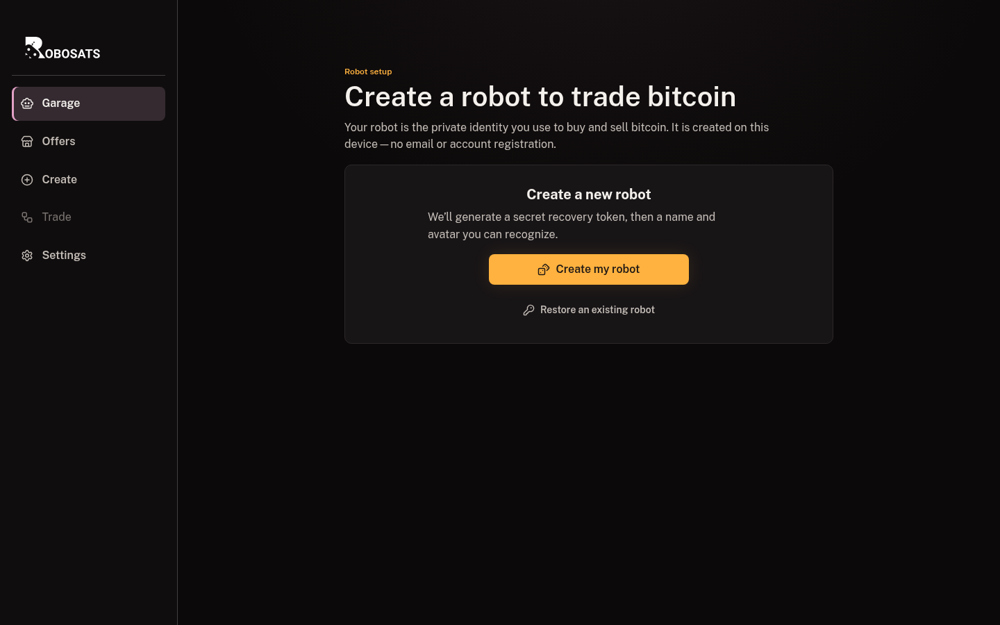
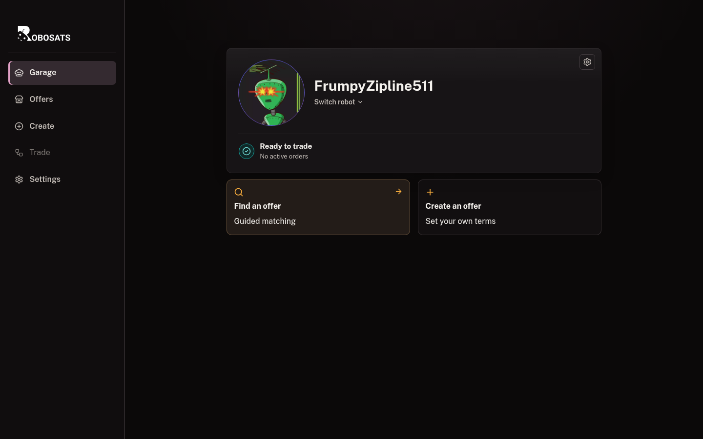

# First trade quick start

[Guide home](README.md) | **First trade** | [Standard Garage](standard-garage-guide.md) | [Safety and identity](identity-and-privacy.md)

This is the shortest safe route through a first RoboSats trade. It leaves advanced options for later and points out the moments when you should slow down.

Allow enough uninterrupted time to complete the setup and fiat exchange. Tor can make a healthy step take longer than expected.

## Before you begin

Have these ready:

- A private password manager or another safe place for one robot token.
- A Lightning wallet that can pay and receive the amounts shown by the client.
- A fiat payment method you can use promptly.
- Tor Browser, or a RoboSats Exp. app showing that Tor is connected.

Decide your direction before opening an offer:

- **Buy BTC:** send fiat, receive bitcoin over Lightning.
- **Sell BTC:** lock bitcoin in escrow, receive fiat.

## 1. Create your private robot

Open **Garage**, then select **Create my robot**.

1. **Create my robot** creates a fresh identity locally.
2. **Restore an existing robot** is only for a robot you already backed up.

The robot is not an account. There is no email or password reset.

## 2. Back up the token before trading

Copy the token or download its JSON backup, then store it privately before continuing.

> **Stop and check:** anyone with this token can recreate the robot. Nobody can recover it for you if every copy is lost.

**You should now see:** a generated nickname and avatar, followed by the Standard Garage.

## 3. Find terms you understand

From the Garage, select **Find an offer**.

Choose whether this trade should buy or sell bitcoin.

The remaining stages ask for the fiat currency, exact amount, and payment method.

Review a matching offer, or create your own if no suitable match exists. Before accepting, check:

- Direction.
- Fiat and bitcoin amounts.
- Payment method.
- Premium.
- Bond percentage.
- Expiry.
- Coordinator.

Do not continue merely because an offer is labeled as the best match. It still needs to fit you.

## 4. Lock the bond once

Both traders lock a small Lightning bond. It discourages abandonment and is handled according to the coordinator protocol when the trade resolves.

1. Confirm the amount in sats.
2. Copy or scan the current Lightning invoice.
3. Pay it once and keep the trade open while detection finishes.

> **If the wallet says paid but the page has not changed:** wait and refresh the trade once. Do not pay the invoice again.

**You should now see:** the next setup step for your side of the trade.

## 5. Follow the buyer or seller path

### If you are buying bitcoin

Provide a Lightning invoice from your wallet so the coordinator can route your payout after the seller releases escrow.

Use a current invoice for the exact amount shown. Keep your wallet available to receive.

### If you are selling bitcoin

Pay the displayed Lightning escrow invoice. This locks the bitcoin being traded while the buyer sends fiat.

Confirm the sats amount, pay once, and wait for the coordinator to detect it.

**You should now see:** encrypted trade chat after both sides complete setup.

## 6. Exchange fiat in encrypted chat

Use the chat for the payment destination, reference, and anything needed to identify the transfer.

### Buyer

1. Verify the destination and amount.
2. Send fiat through the agreed method.
3. Select **Confirm fiat sent** only after submission.
4. Stay available until the seller confirms receipt.

### Seller

1. Check the receiving account directly.
2. Confirm that the full amount is final and usable.
3. Release escrow only after that verification.

Never rely on a screenshot, email, notification, or chat message as proof of payment.

## 7. Finish and keep any record you need

1. Download the trade overview if you want a separate record.
2. Rate the peer and coordinator if desired.
3. Return to the Garage.

**You should now see:** a completed trade screen and no further payment action.

The same robot can be reused, but a fresh robot offers better separation between trades. Keep the old token if its recovery still matters.

## If something feels stuck

- Wait before repeating a payment or state-changing action.
- Use the trade refresh once.
- Check **Settings > Coordinators**.
- Keep the robot token.
- Do not create a replacement identity just because a coordinator is temporarily slow.

Continue with the [full Standard Garage guide](standard-garage-guide.md) for creating your own offer, recovery, notifications, Cash F2F, and detailed troubleshooting.

---

[Guide home](README.md) | Next: [Standard Garage](standard-garage-guide.md)
