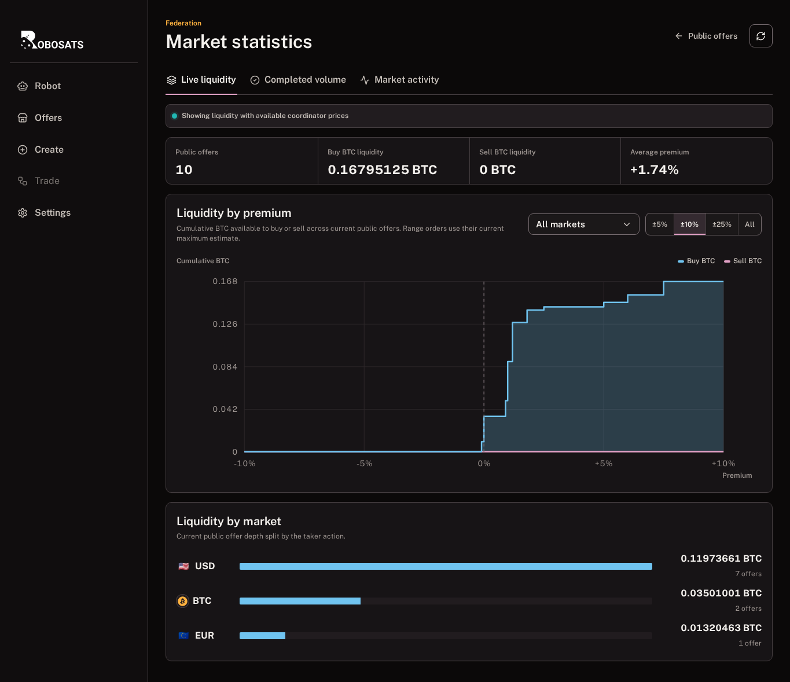
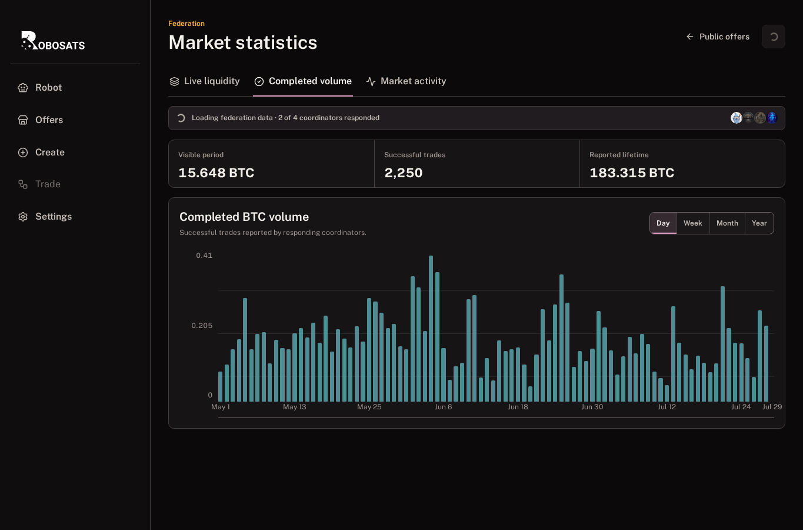
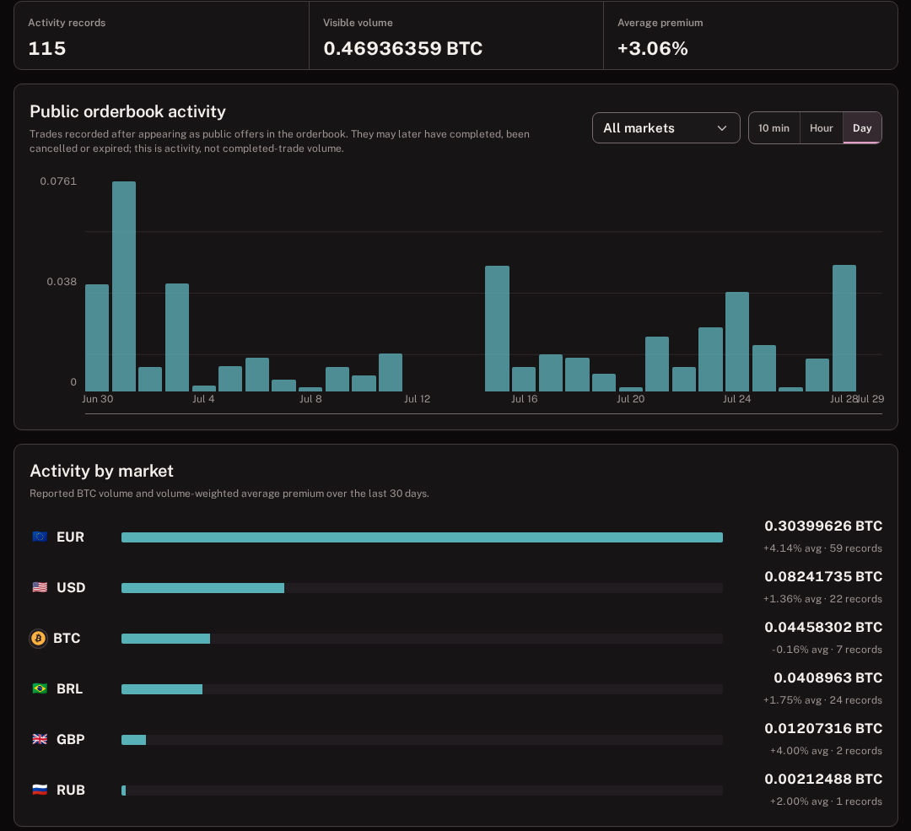
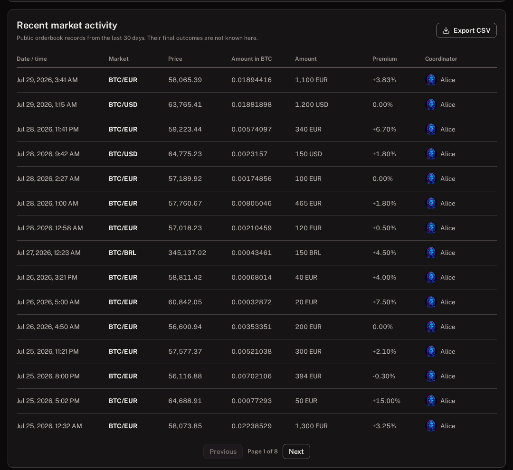

# Market statistics guide

[Guide home](README.md) | [Standard Garage](standard-garage-guide.md) | [Pro Mode](pro-mode-guide.md) | **Market statistics**

Statistics answers three different questions:

1. **Live liquidity:** what can be traded right now?
2. **Completed volume:** how much successful BTC volume are coordinators reporting?
3. **Market activity:** what appeared publicly in the orderbook recently?

These datasets are not interchangeable. An order that appeared publicly may later complete, expire, pause, or be cancelled.

Open **Offers > Statistics**, or **Settings > Statistics**.

## Check coverage before interpreting a number

The client queries enabled coordinators over Tor. The coverage banner reports how many answered.

- Partial data can appear while other coordinators are still loading.
- A slow or offline coordinator does not erase data already returned by others.
- A complete-looking chart with partial coverage is still only a partial federation snapshot.

Use refresh once when needed, then allow Tor requests to settle.

## 1. Live liquidity

Live liquidity is the actionable view. It describes offers currently visible in the public orderbook.

Read it in this order:

1. **Market filter:** choose a currency instead of mixing markets you do not intend to use.
2. **Summary:** inspect public-offer count, buy-side BTC, sell-side BTC, and weighted premium.
3. **Depth chart:** find how much cumulative BTC is available by premium.

### Depth-chart directions

- Blue represents liquidity for a taker who wants to **buy BTC**.
- Pink represents liquidity for a taker who wants to **sell BTC**.
- A larger step means one or more offers add meaningful volume near that premium.
- Zero separates discounted and positive-premium territory.

Choose `+/-5%`, `+/-10%`, `+/-25%`, or the full range to change the visible premium window.

Select a premium step to open the contributing offers. If several share the selected band, the dialog lists each one for review.

### Range offers

A minimum/maximum offer is estimated at its current maximum for liquidity. The actual amount is chosen within the permitted range during offer review.

### What live liquidity can tell you

- Whether a matching direction and currency are currently available.
- Rough BTC depth near a premium.
- Which real offers contribute to a chart step.

### What it cannot tell you

- Whether an offer will still exist after another trader acts.
- Whether the payment method is suitable for you.
- Whether the coordinator and bond terms are acceptable.

Always review the actual offer.

## 2. Completed volume

Completed volume is successful BTC volume reported by responding coordinators.

Read:

1. **Visible period:** BTC volume in the selected chart interval.
2. **Successful trades:** completed trades represented by returned data.
3. **Reported lifetime:** lifetime BTC reported by the coordinators that answered.
4. **Day / Week / Month / Year:** chart granularity, not a prediction.

### Why it uses BTC

The available coordinator endpoints expose a consistent bitcoin-volume measure across markets. Adding EUR, USD, JPY, and other fiat amounts into one number would be misleading.

Completed volume is broad federation context. It does not reveal private trade details or read your Fleet history.

## 3. Market activity

Market activity contains orders recorded after they appeared publicly.

The three summary numbers are:

- **Activity records:** public records in the response.
- **Visible volume:** their reported BTC-equivalent amount.
- **Average premium:** a volume-weighted average for the visible records.

Use:

- **All markets** or one currency to change the comparison.
- **10 min**, **Hour**, or **Day** to change aggregation.
- **Activity by market** to compare BTC-equivalent public volume and average premium.

> **Important:** this is public-orderbook activity, not completed-trade volume. Every record may later have completed, expired, paused, been replaced, or been cancelled.

### Inspect individual public records

The table includes:

- Date and time.
- Market and reference price.
- Amount in BTC and fiat.
- Premium.
- Publishing coordinator.

Select **Export CSV** to inspect the currently visible public records outside the client.

### What market activity can tell you

- Which currencies recently had public offers.
- Approximate public volume distribution.
- Typical visible premiums during the selected period.
- Which coordinators contributed the records returned.

### What it cannot tell you

- Which records completed.
- Who traded.
- Whether fiat was sent.
- Why an order disappeared.

## Average premium in plain language

Premium compares an offer's bitcoin price with the coordinator's reference market price:

- `+3%` is approximately 3% above the reference.
- `-3%` is approximately 3% below the reference.
- `0%` is near the reference.

Positive or negative is not automatically good or bad. Direction, payment method, liquidity, bond, coordinator terms, and counterparty risk all matter.

Aggregate premiums are volume weighted. A large order affects the average more than a small one.

## A practical workflow

Suppose you want to buy `200 EUR` of bitcoin:

1. Open **Live liquidity**.
2. Filter to EUR.
3. Inspect depth near the premium you accept.
4. Select a relevant step and review the actual offers.
5. Compare payment methods, bonds, expiry, and coordinator.
6. Return to **Offers** or use **Guided trade**.
7. Use **Market activity** only as recent public context.
8. Use **Completed volume** only as broad successful-volume context.

Statistics should support offer review, never replace it.

## Privacy

Statistics aggregates public orderbook records and coordinator-reported totals. It does not query or publish:

- Robot token.
- Fleet key.
- Private chat.
- Bank details.
- Private Fleet history.

Opening the page still sends requests to enabled coordinators. Use Tor Browser or an installed app's embedded Tor transport.

## Troubleshooting

### Only some coordinators answered

Wait for coverage to settle. A reachable coordinator can still contribute useful data while another is offline.

### The chart changed after refresh

Offers are taken, paused, cancelled, renewed, and expired. Reference prices also move. Live liquidity is expected to change.

### Completed volume and market activity disagree

They measure different events. Completed volume counts coordinator-reported success; activity counts public appearance regardless of outcome.

### A premium point opens a nearby group

The chart groups offers into selectable premium bands. The dialog title and listed offer premiums are authoritative for the selected band.

### First opening is slow

Statistics code and data are lazy-loaded to keep initial startup smaller. Later opens in the same session can reuse loaded code and valid cached responses.

---

[Guide home](README.md) | Previous: [Cash F2F map](f2f-map-guide.md) | Next: [Notifications](notifications-guide.md)
