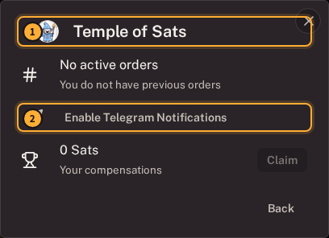
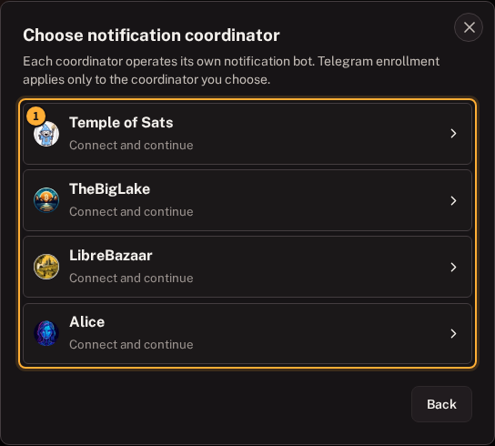

# Notifications guide

[Guide home](README.md) | [Standard Garage](standard-garage-guide.md) | [Pro Mode](pro-mode-guide.md) | **Notifications**

Notifications can remind you that a trade needs attention. They cannot prove that a payment succeeded, and they should not be your only way to watch a time-sensitive exchange.

RoboSats Exp. has three alert paths:

| Alert | Where it works | Connected to | Main privacy consideration |
| --- | --- | --- | --- |
| Telegram | Telegram plus a supporting coordinator bot | One robot at one coordinator | The bot can associate that Telegram conversation with the robot |
| Native notification | Supported installed Android and desktop apps | The local app | The operating system displays notification content |
| Trade sound | The visible Trade page | The currently open trade | Nearby people may hear it |

You can trade without Telegram.

## Telegram in the Standard Garage

Telegram setup appears after a coordinator knows the robot and reports a bot name and a one-time setup token.

1. Open **Robot**.
2. Open **Robot settings**.
3. Select the coordinator hosting or knowing the relevant order.

1. Confirm that you opened the intended coordinator.
2. Select **Enable Telegram Notifications**.

The setup dialog then lets you:

- Scan the QR code with a device running Telegram.
- Select **Enable** to open Telegram.
- Select **Browser** to open the bot's `t.me` link.

Start the bot conversation when Telegram asks.

**You should now see:** a Telegram conversation with that coordinator's bot. Alerts apply to this robot at this coordinator only.

If the action is unavailable, the selected coordinator has not supplied a current setup token. Refresh the robot status and try again while it is reachable.

## Telegram for a Pro Mode robot

Enrollment is still per robot and per coordinator; it is not a Fleet-wide switch.

1. Open **Pro Desk > Robot Fleet**.
2. Find the intended robot.
3. Select its paper-plane action.

1. Select the coordinator whose bot should notify this robot. **Connect and continue** means the client is still requesting current setup data.

After the coordinator responds, scan its QR code or open Telegram using the offered action.

Repeat this only for robots and coordinators that genuinely need alerts.

## Telegram privacy tradeoff

The setup link contains the coordinator bot name and a coordinator-issued start token for the selected robot.

When the bot is started:

- The coordinator bot can associate that Telegram conversation with the robot.
- Telegram can observe its normal account and network metadata.
- Opening Telegram leaves the Tor-protected client environment.

This can weaken separation between a private robot and a personal Telegram identity.

Consider:

- Using a Telegram identity that is not publicly connected to you.
- Enrolling only the robot and coordinator that need alerts.
- Avoiding personal details in bot messages.
- Treating the one-time setup link as private.

Telegram setup does not require or receive the Fleet key or robot token. Never paste either secret into the bot.

## Native notifications in installed apps

Supported Android and desktop builds expose a notification control:

1. Open **Settings**.
2. Find **Android privacy** or **Desktop privacy**.
3. Turn on **Notifications**.
4. Accept the operating-system permission request.

**You should now see:** the control marked **Enabled**, provided the app setting and operating-system permission are both active.

If it remains disabled:

- Check notification permission in Android, Windows, macOS, or Linux settings.
- Permit background activity when your platform requires it.
- Verify the embedded Tor connection in **Settings**.
- Toggle notifications off and on after fixing the system permission.

iOS shows its embedded Tor privacy status but does not currently expose the same client-side notification toggle.

## How Pro Mode avoids duplicate feedback

Pro Mode checks several robots in the background. Those checks can discover a transition even when its Trade page is not open.

To avoid duplicate sound and system feedback:

- A background Pro refresh can produce one native notification.
- Trade audio belongs to the relevant visible Trade page.
- Reopening the same transition should not notify it again.

This keeps the Pro Desk useful without turning every background refresh into an audible event.

## Trade sounds

Trade sounds have no separate synchronization setting. They are short cues for meaningful changes on the visible Trade page.

Keep the relevant trade open when relying on sound, and still read the displayed state. A sound is never proof that a Lightning or fiat payment succeeded.

## Reliability over Tor

Alerts depend on the client or coordinator learning about a state change:

- A Nostr hint can request a fast refresh.
- The coordinator API confirms authoritative order state.
- An offline coordinator can delay both.
- Telegram depends on the coordinator bot and Telegram.
- Native delivery depends on app state, Tor, and platform background limits.

Return to the Trade page before a deadline. Notifications are prompts, not protocol receipts.

## Troubleshooting

### Coordinator says Connect and continue

The robot has not returned a current Telegram setup token for that coordinator. Leave the dialog open while it connects.

### Telegram setup could not connect

Keep the robot and retry when the coordinator is reachable. Do not replace an identity to solve a temporary bot delay.

### QR code opens the wrong Telegram account

Cancel before starting the bot and reopen the link in the intended Telegram environment. The client cannot choose an account inside Telegram.

### Native alerts work only while the app is open

Check battery optimization, background activity, and notification permissions. The operating system can suspend network work even when the in-app switch is enabled.

### Notification arrived but the page is older

Open the trade and let its interactive refresh finish. A hint requests attention; the coordinator response determines the displayed state.

## Notification checklist

- [ ] Intended robot selected.
- [ ] Intended coordinator selected.
- [ ] Telegram identity acceptable for the desired privacy level.
- [ ] No robot token or Fleet key pasted into Telegram.
- [ ] Native permission enabled only on trusted devices.
- [ ] Wallet, fiat account, and Trade page still used to verify real actions.

---

[Guide home](README.md) | Previous: [Market statistics](market-statistics-guide.md)
