# Pro Mode and Robot Fleet guide

Pro Mode is for users who manage several RoboSats identities or trades at once. It adds a **Robot Fleet**, a **Pro Desk**, reusable **offer presets**, encrypted cross-device synchronization, and completed-trade history.

The trading protocol does not change. Every Fleet robot is still a standard RoboSats robot and every trade still follows the normal bond, escrow, chat, and payout flow.

## Standard Garage or Pro Mode?

| Standard Garage | Pro Mode |
| --- | --- |
| Best for one trade at a time | Best for several separate identities or concurrent trades |
| One active robot selected locally | Up to six active Fleet robots |
| Back up one robot token | Back up one Fleet key, plus optional individual robot tokens |
| One order view | Combined trade summary, Fleet list, presets, and history |

> **The Fleet key controls every identity in the Fleet.** Store it with the same care as a wallet seed. Do not paste it into a website, chat, support ticket, or issue report.

The screenshots below use example robots, orders, and amounts. They do not contain real Fleet keys, tokens, invoices, or trades.

## 1. Enable Pro Mode

Open **Settings** and turn on **Pro Mode**.

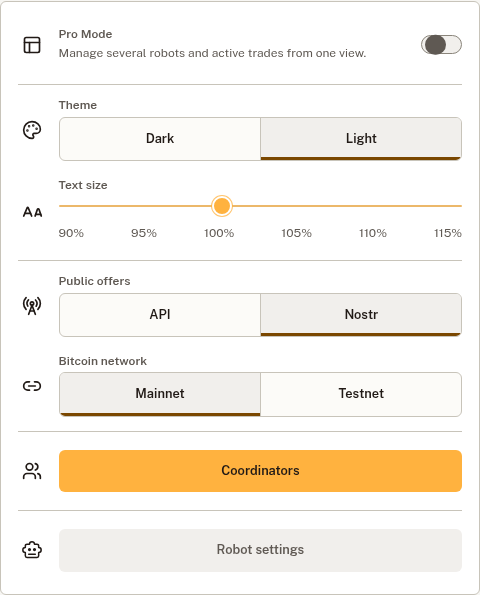

The Standard Garage is hidden while Pro Mode is enabled. Its existing robots are not deleted; turn Pro Mode off to show them again.

## 2. Create or restore a Robot Fleet

Choose:

- **Set up a new Fleet** for a new group of robots.
- **Restore Fleet** when you already have a Fleet key.
- **Keep standard Garage** to leave Pro Mode without creating a Fleet.

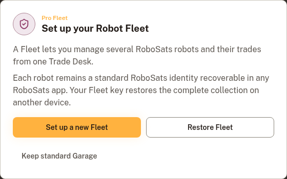

## 3. Back up the Fleet key

Copy or download the Fleet key before continuing.

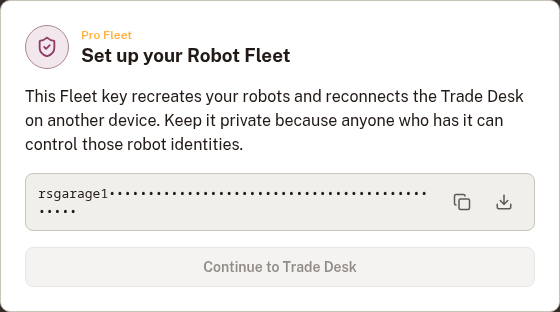

The key is required to decrypt the Fleet's remote records and deterministically recreate the standard token for each saved robot entry. A Fleet recovery therefore needs:

1. The exact Fleet key.
2. At least one reachable coordinator relay that still retains the encrypted Fleet records.

Back up individual robot tokens as well when a specific identity must remain recoverable independently of the Fleet record.

## How a Fleet identity works

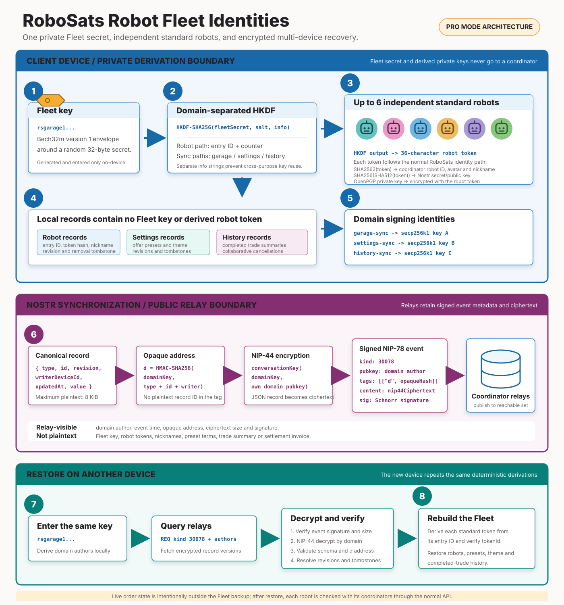

### What is synchronized

| Record | Included |
| --- | --- |
| Robot Fleet | The saved robot entries needed to recreate each standard robot token, identity metadata, and removal markers |
| Preferences | Offer presets and the synchronized theme setting |
| Completed history | Completed trades and collaborative cancellations; a role-appropriate settlement invoice may be included when available |

### What is not synchronized as Fleet backup

- Live order and trade status.
- Coordinator-side order records.
- The private trade chat transcript.
- Dispute results.

Live status is fetched from coordinators after the Fleet is opened or restored.

## 4. Add independent robots

Open **Robot Fleet** and select **Add Robots**. A Fleet can contain up to six active robots.

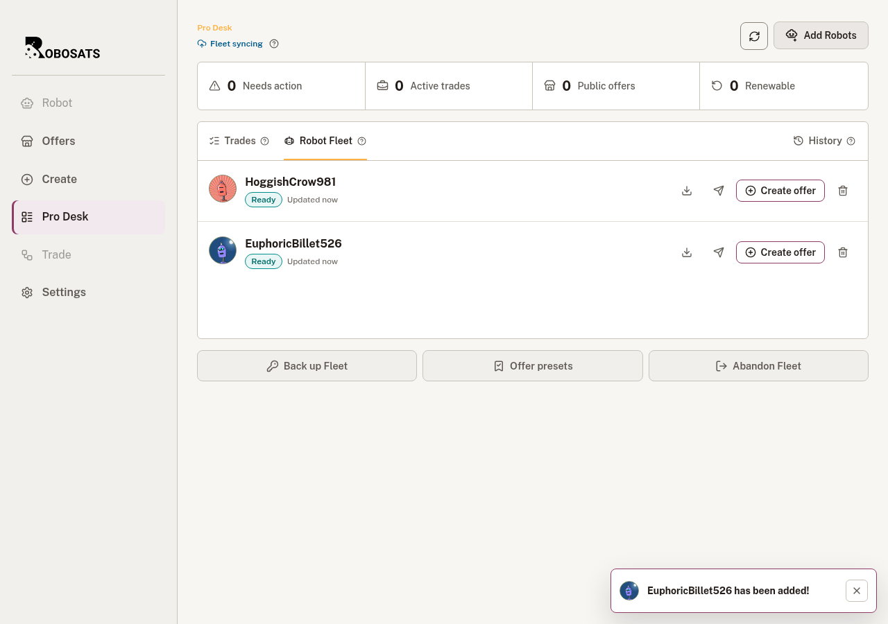

Each robot:

- Has its own standard RoboSats token, avatar, Nostr key, and encrypted chat identity.
- Can be recovered in another compatible RoboSats client using its individual token.
- Can hold one coordinator order at a time.

Use a fresh available robot when possible. The selector warns when an identity was used before because reuse weakens separation between trades.

## 5. Choose the robot for an offer

Select **Create offer**, then choose an available robot.

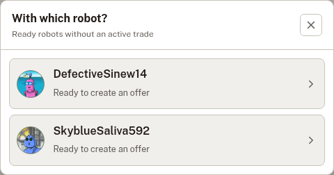

Busy robots are excluded. The coordinator is selected during offer creation; it is intentionally not stored in an offer preset.

Taking a public offer also reserves one available Fleet robot and opens the trade.

## 6. Save reusable offer presets

Open **Offer presets** to create, use, edit, duplicate, or remove reusable terms.

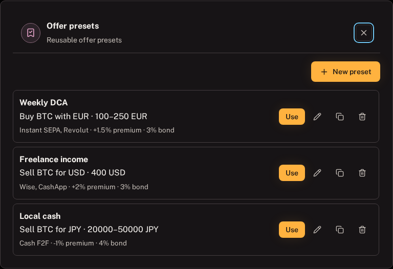

A preset can retain the normal and advanced offer parameters, including direction, currency, amount or range, payment methods, premium, bond, expiry, and other offer options. You still review the terms and choose a coordinator for each new order.

The examples above illustrate different useful jobs:

| Preset | Saved terms | Typical use |
| --- | --- | --- |
| Weekly DCA | Buy `100-250 EUR`, Instant SEPA or Revolut, `+1.5%` premium, `3%` bond | Repeat a regular bitcoin purchase without re-entering every field |
| Freelance income | Sell `400 USD`, Wise or CashApp, `+2%` premium, `3%` bond | Convert a recurring payment into bitcoin |
| Local cash | Sell `20,000-50,000 JPY`, Cash F2F, `-1%` premium, `4%` bond | Reuse a preferred in-person trade range |

To use one:

1. Select **Use** next to the preset.
2. Choose a robot that does not already hold an order.
3. Review the populated offer form.
4. Choose the coordinator for this order and publish when the terms are correct.

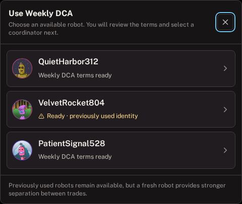

The warning beside a previously used identity is informational. It remains selectable, but a fresh robot gives stronger separation between trades.

## 7. Monitor trades from the Pro Desk

The summary strip separates orders into:

- **Needs action:** the next required step belongs to you.
- **Active trades:** a peer is involved and the trade is in progress.
- **Public offers:** published offers waiting for a taker.
- **Renewable:** paused, expired, or otherwise resumable offers.

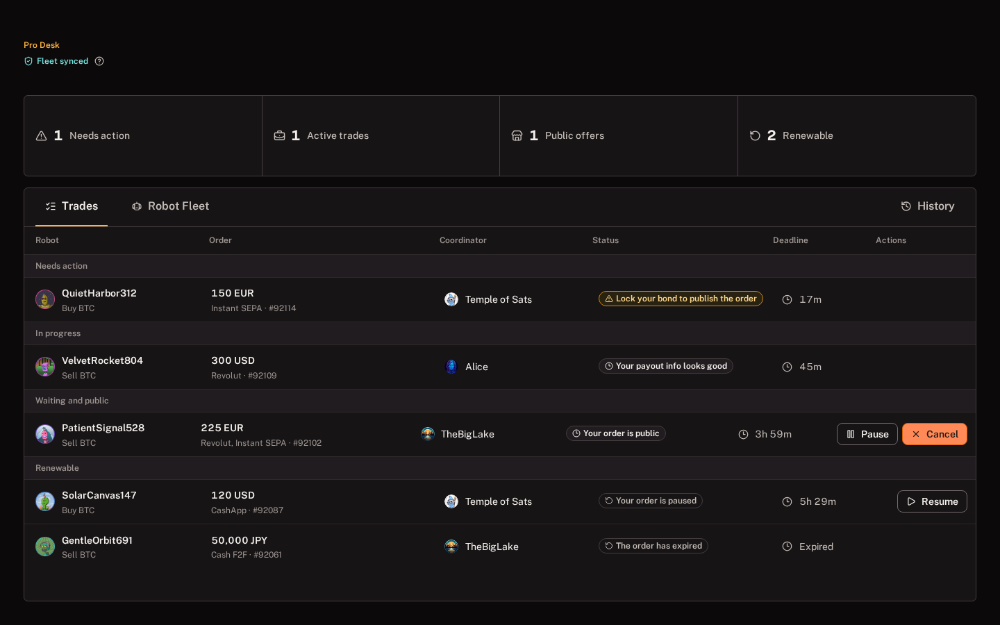

The example shows the main actions without opening every trade:

| Example state | What it means | What you can do |
| --- | --- | --- |
| Lock your bond | The offer is not public yet because the maker bond is waiting | Open the row and lock the displayed bond invoice |
| Active trade | A peer is involved and the coordinator is waiting for the next trade step | Open the row to continue the normal trade flow |
| Your order is public | Other robots can currently take the offer | **Pause** it temporarily or **Cancel** it permanently |
| Your order is paused | The offer is hidden but still belongs to that robot | Select **Resume** to return it to the public book |
| The order has expired | The former offer can be renewed with the same robot | Open the row, review its terms, and select **Renew offer** |

Use the tabs:

- **Trades** for live, public, and renewable orders.
- **Robot Fleet** for identities, backups, and per-robot actions.
- **History** for completed trades and collaborative cancellations.

Select any trade row to open the full trade screen. The buyer and seller actions are the same as in the [Standard Garage guide](standard-garage-guide.md#6-complete-your-side-of-setup).

## 8. Check synchronization and history

**Fleet syncing** means local Fleet changes are still being published. **Fleet synced** means no local Fleet changes are waiting to be published.

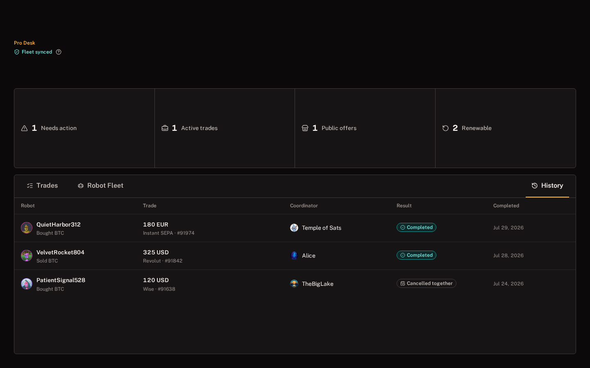

History records the robot, buy or sell role, amount, payment method, coordinator, result, and completion time. Select a row to inspect the saved summary:

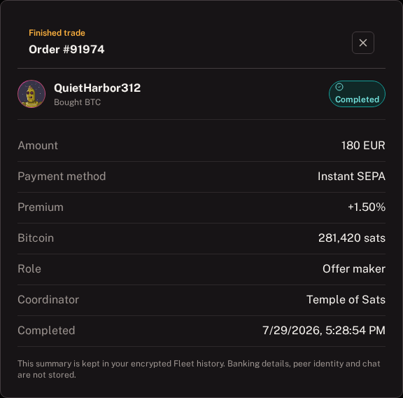

History is recorded when the client observes a terminal trade state. Keep the client open long enough to receive that final coordinator update. Old trades that were never observed as complete cannot always be reconstructed later.

The detail view also states what is deliberately omitted. Banking details, peer identity, and chat are not stored in Fleet history. The synchronized history is a convenience record, not coordinator proof or an accounting ledger. Download the trade overview at completion when you need a separate receipt.

## 9. Restore on another device

Enable Pro Mode, select **Restore Fleet**, and enter the Fleet key.

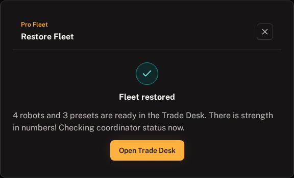

Recovery can take one or two minutes over Tor because the client queries coordinator relays, decrypts the latest records, and then checks live robot status with coordinators.

The completion count lets you verify that the expected robots and presets were recovered before entering the Trade Desk. Completed-trade history follows from its separate encrypted Fleet record.

Do not close the first device until the new device shows the expected robots, presets, history, and **Fleet synced**.

## Nostr and privacy model

The client separates Fleet data into independent cryptographic domains and publishes encrypted [NIP-78](https://github.com/nostr-protocol/nips/blob/master/78.md) kind `30078` records to coordinator relays:

- Content is encrypted with NIP-44-derived conversation keys.
- Record addresses are opaque values derived from the Fleet secret.
- Robot Fleet, preferences, and completed history use separate signing identities.
- Relays receive signed ciphertext, not robot tokens, preset contents, or history plaintext.

Relays can still observe event metadata and timing. The web client should be used over Tor, and installed clients route coordinator traffic through their embedded Tor transport.

## Switch back to the Standard Garage

Open **Settings** and turn off **Pro Mode**. Standard Garage robots reappear exactly as they were. Fleet robots remain separate and return when Pro Mode is enabled again.

## Troubleshooting

### A robot remains on "Waiting for coordinators"

No coordinator request has completed yet. Wait, use the manual refresh button, or check **Settings > Coordinators**. Do not remove the robot solely because a coordinator is temporarily offline.

### Fleet restore says no Fleet was found

Confirm the key has no extra spaces and retry after the coordinator relays reconnect. A temporarily unreachable relay can make the first attempt incomplete.

### A robot is unavailable for a new order

Open its existing order from **Trades**. A robot can hold only one order at a time, including a public, paused, renewable, or active order.

### The Fleet says "syncing"

Keep the client open and connected to Tor. When it changes to **Fleet synced**, no local Fleet records are waiting to be published.
