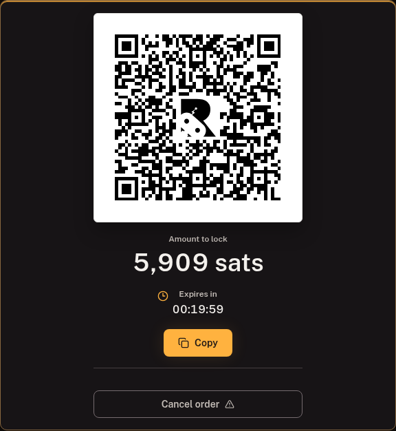
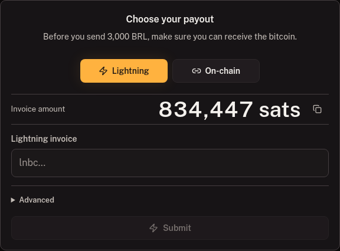
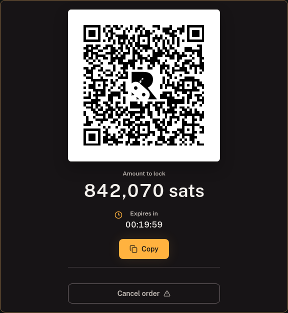
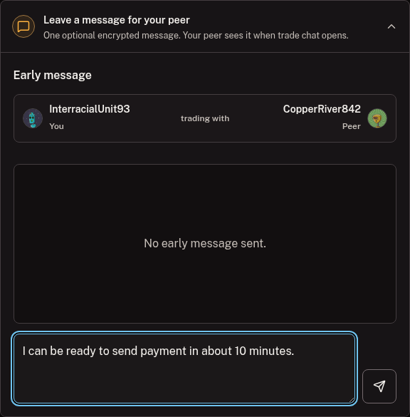
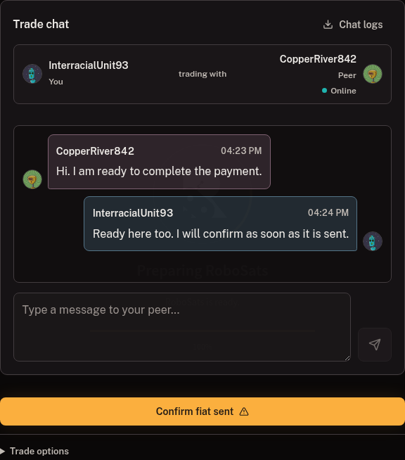
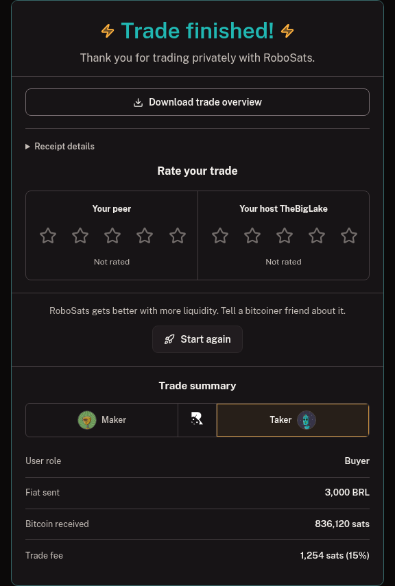
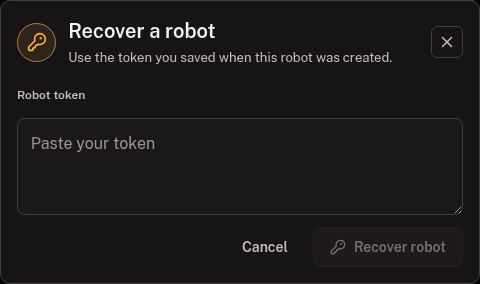

# Standard Garage guide

[Guide home](README.md) | [First trade](first-trade-quick-start.md) | **Standard Garage** | [Pro Mode](pro-mode-guide.md)

The Standard Garage keeps one selected robot in a focused workspace. It is the clearest way to make one order at a time, and the best place to begin if RoboSats is new to you.

Already comfortable with the classic frontend? Read the short [transition guide](classic-frontend-transition.md) first.

## What this guide covers

- Creating and safely backing up a robot.
- Finding an existing offer or publishing your own.
- Completing the buyer and seller setup paths.
- Exchanging fiat through encrypted chat.
- Finishing, recovering, reusing, or replacing a robot.

## Before you start

Have these ready:

- A private place to save the robot token, preferably a password manager plus a separate backup.
- A Lightning wallet that can pay or receive the exact amounts shown during a trade.
- A fiat payment method you can use promptly.
- Tor Browser, or a RoboSats Exp. app with Tor connected.

> **Your robot token is the identity.** It controls the robot, its private keys, and access to coordinator orders associated with it. There is no password reset. Never send it to a peer, coordinator, support contact, issue tracker, or chat room.

## Quick glossary

| Term | What it means here |
| --- | --- |
| Robot | A private trading identity with its own nickname, avatar, and keys |
| Maker | The trader who publishes an offer |
| Taker | The trader who accepts an existing offer |
| Bond | A small Lightning amount that discourages abandonment |
| Escrow | The seller's bitcoin held by the coordinator during the fiat exchange |
| Coordinator | The independent server hosting and enforcing an order |

**Buy BTC** means you send fiat and receive bitcoin. **Sell BTC** means you lock bitcoin and receive fiat.

## Part 1: Create and protect the robot

### 1. Generate a robot

Open **Robot**.

1. Select **Generate token** for a fresh identity.
2. Use **Recover with existing token** only when you already possess a backup.

The token is generated on your device. It is not an account registered with RoboSats.

The client derives the same coordinator credential, Nostr identity, nickname, and avatar whenever this token is recovered. It also associates an OpenPGP keypair with the robot for encrypted trade communication. The [identity and privacy guide](identity-and-privacy.md) explains each part.

### 2. Back up the token

Copy the token or download the JSON backup, then store it somewhere private before continuing.

Keep at least one copy away from the device used for trading. If every copy is lost, nobody can recreate the robot. If another person obtains it, they can recreate and control the same identity.

**You should now see:** the nickname and avatar derived from the token.

### 3. Meet the identity

1. Confirm that the robot has a nickname and avatar.
2. Select **Continue** to enter the Garage.

This nickname is not a username you chose. It is a consistent visual check that the same token produced the same identity.

## Part 2: Choose an offer

### 4. Use the Garage

1. **Find a trade** asks a few plain-language questions and narrows the orderbook.
2. **Create offer** lets you publish your own complete terms.
3. **Robot settings** contains backups, keys, coordinator status, and Telegram setup.

You can also open **Offers** in the main navigation to compare the full public orderbook.

The first coordinator check may take longer over Tor. The Garage keeps a loading state visible before concluding that no order was found. You can browse other client pages while it finishes.

### 5. Find a matching offer

Select **Find a trade**.

Choose **Buy bitcoin** or **Sell bitcoin**.

The following stages ask for the fiat currency, exact fiat amount, and a payment method you can actually use.

The guide lists current matches. Review one, or continue into **Create offer** with your choices already filled in.

For a range offer, the review screen pre-fills your requested amount when it falls within the maker's range.

> **Direction check:** say it before continuing.
>
> **Buy bitcoin:** send fiat, receive bitcoin.
>
> **Sell bitcoin:** lock bitcoin, receive fiat.

### Browse the full orderbook

Use **Offers** when you want to compare direction, amount, premium, payment method, expiry, and coordinator yourself.

- Select **Guided trade** to open the same beginner flow without leaving the orderbook.
- Select **Statistics** for current liquidity and public activity context.
- Open the Cash F2F map when current face-to-face offers include approximate areas.

Statistics do not prove that a specific public order completed. Read the [market statistics guide](market-statistics-guide.md) before using those aggregates.

### Create your own offer

Choose your direction, amount or range, currency, payment methods, premium, bond, and expiry. Advanced controls are optional; leave them at their defaults unless you understand the effect.

The coordinator is selected for every new offer. Review its limits, fees, and availability before publishing.

### Review before committing

The offer review summarizes:

- What you send.
- What you receive.
- Premium.
- Payment method.
- Bond.
- Expiry.
- Coordinator.

Do not continue until both sides of the summary match your intention. A label such as **Best match** is a sorting aid, not a safety guarantee.

**You should now see:** a Trade screen with the next action, normally a bond invoice.

## Part 3: Set up the trade

### 6. Lock the fidelity bond

Both maker and taker lock a small Lightning bond.

1. Confirm the amount in sats.
2. Copy or scan the current Lightning invoice.
3. Pay it once.
4. Keep the trade open while the coordinator detects it.

The maker's offer becomes public only after its bond is detected. A taker locks a bond after accepting an offer. A cooperative trade returns bonds according to the coordinator protocol.

Tor can delay the response after your wallet reports success. **Do not pay the same invoice twice.** If it expires unpaid, use the current action offered by the Trade screen.

**You should now see:** either payout setup as the buyer, or escrow setup as the seller.

### 7A. Buyer: submit payout information

The buyer supplies the destination where the bitcoin payout should arrive.

1. Confirm the invoice amount displayed by the client.
2. Choose Lightning unless the trade explicitly supports and you intentionally choose on-chain payout.
3. Create a current invoice in your receiving wallet.
4. Paste and submit it.

Keep the receiving wallet available. Do not use an invoice that has already expired or been paid.

The client waits for the seller to lock the bitcoin trade amount in escrow.

### 7B. Seller: lock the trade amount

The seller pays the displayed escrow invoice.

1. Confirm the amount in sats.
2. Copy or scan the invoice.
3. Pay it once.
4. Wait for coordinator detection.

This is the bitcoin being traded, separate from the smaller fidelity bond.

The client waits for the buyer's payout information when needed.

### Optional early message

Some coordinators let you prepare one short message while the trade is still in setup. When it is available, expand **Leave a message for your peer**.

1. Type one short preparation note.
2. Send it once. It cannot be replaced with a second early message.
3. Continue the normal setup steps. Sending a message is never required.

Both maker and taker can use this feature during the supported setup window. The message belongs to the robot and order currently shown; another robot cannot send or read it.

The client encrypts the note for the peer's robot using its OpenPGP public key. The coordinator carries the encrypted text, but the peer does not see the note until the normal trade chat opens. This prevents an early message from becoming a separate conversation before both sides finish setup.

A useful early message is brief and practical, for example: “I can be ready to send payment in about 10 minutes.” Keep payment destinations, proof of payment, exact Cash F2F meeting details, and other sensitive instructions for the full encrypted trade chat.

If this section is absent, the coordinator does not advertise optional pre-chat support or the setup window has already passed. Nothing is wrong and the trade continues normally; use the full encrypted chat when it opens.

**You should now see:** **Chat with the buyer** or **Chat with the seller** after both sides complete setup.

## Part 4: Exchange fiat

### 8. Use encrypted trade chat

1. Use the chat for the payment destination, reference, and necessary transfer details.
2. Keep the exact information inside the client.
3. Use the protocol action below chat only after the real-world action happened.

Each robot has a separate OpenPGP keypair. Messages encrypted for one robot cannot be opened by another robot. The coordinator transports encrypted messages but does not need their plaintext.

For Cash F2F, agree on the exact public venue and time here. The public map should contain only an approximate area.

### 9A. Buyer: send fiat

1. Verify the destination, payment method, and fiat amount.
2. Send the payment.
3. Check that your payment service accepted it.
4. Select **Confirm fiat sent** only after it was actually submitted.
5. Stay available until the seller confirms receipt.

### 9B. Seller: verify fiat, then release

1. Check the receiving bank, payment app, or cash directly.
2. Confirm the full amount is final and usable.
3. Release escrow only after that verification.

Never use a screenshot, email, push notification, or the peer's statement as proof that fiat arrived.

> **Stay nearby:** the active fiat exchange is the wrong time to close the client or become unreachable.

## Part 5: Finish and recover

### 10. Complete the trade

After escrow release, the coordinator routes the payout and the client shows the completed screen.

1. Download the trade overview if you need a separate record.
2. Expand receipt details when useful.
3. Rate the peer and coordinator if desired.
4. Return to the Garage.

**You should now see:** **Trade finished** and no remaining payment action.

It is safe to close the client after any overview you want has been downloaded.

### Reuse or replace the robot

The same robot can be reused. The client warns you first because repeated activity belonging to one identity can be linked by parties that interact with it.

A fresh robot offers stronger separation. Back up any old token that still matters before replacing the robot.

### 11. Recover an existing robot

Open **Robot**, select **Recover**, and enter the exact token.

1. Confirm the recovered nickname and avatar.
2. Review the last known order reported by each reachable coordinator.
3. Use token backup or key controls when needed.

Recovery recreates the token-derived identity. The client then asks coordinators for orders and encrypted key material belonging to it.

An offline coordinator can delay a status without invalidating the token. Keep the identity and retry later.

## Notifications

Telegram setup is tied to one robot at one coordinator. Native alerts are available in supported installed apps.

Notifications are useful reminders, not proof of payment and not a replacement for returning to a time-sensitive Trade screen. Follow the illustrated [notifications guide](notifications-guide.md).

## When can I leave the client?

| Current stage | Guidance |
| --- | --- |
| Token not backed up | Do not leave or replace the robot yet |
| Bond or escrow payment detecting | Stay nearby and do not pay twice |
| Public offer waiting | You may leave after backing up the token; return before expiry |
| Buyer/seller setup | Stay nearby until the next stage is confirmed |
| Fiat exchange | Remain available in encrypted chat |
| Trade completed | Safe after downloading any record you want |

## Troubleshooting

### The Garage is checking for orders

Let the first check finish. Tor circuits and coordinator response times vary. A cached robot remains usable while a fresh check runs.

### No existing orders were found

The coordinators that answered did not report an order for this robot. If you expect one, inspect **Settings > Coordinators**, refresh once, and keep the token.

### Trade is unavailable in navigation

The Trade page becomes available after the current robot creates or takes an offer. Open **Offers** or **Create** first.

### An invoice remains after payment

Do not pay again. Wait, use the trade refresh once, and verify the wallet payment state.

### A coordinator is offline

Keep the token and retry later. Coordinator-side order state cannot be recreated by generating another robot.

### An encrypted message briefly says it cannot be decrypted

Allow the chat to finish loading the current keys and messages. If it remains, refresh the trade once. Do not resend sensitive information until the correct peer identities are visible.

## Final safety checklist

- [ ] Robot token backed up privately.
- [ ] Buy/sell direction confirmed.
- [ ] Fiat and Lightning amounts checked.
- [ ] Payment method, bond, expiry, and coordinator accepted.
- [ ] Every Lightning invoice paid at most once.
- [ ] Exact payment details kept in encrypted chat.
- [ ] Fiat verified in the receiving account before escrow release.
- [ ] Trade overview downloaded if a separate record is needed.

---

[Guide home](README.md) | Next: [Pro Mode and Robot Fleet](pro-mode-guide.md)
