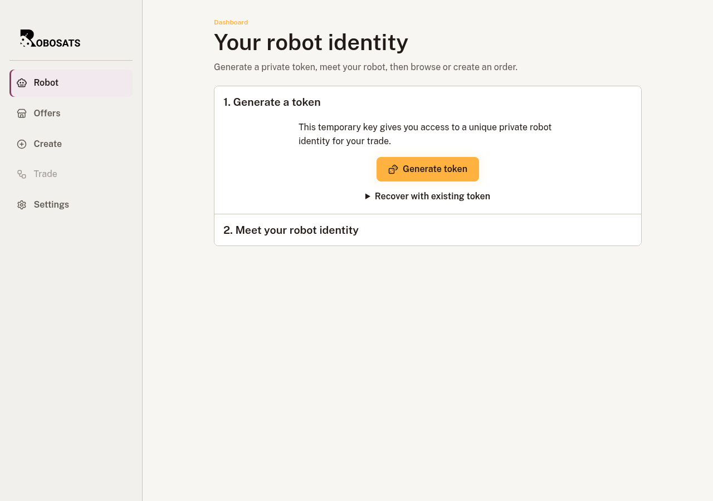
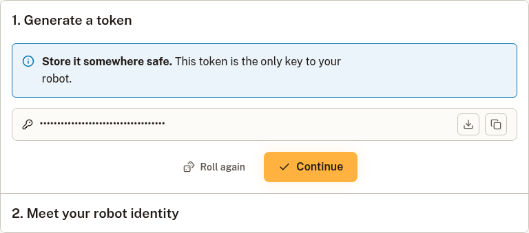
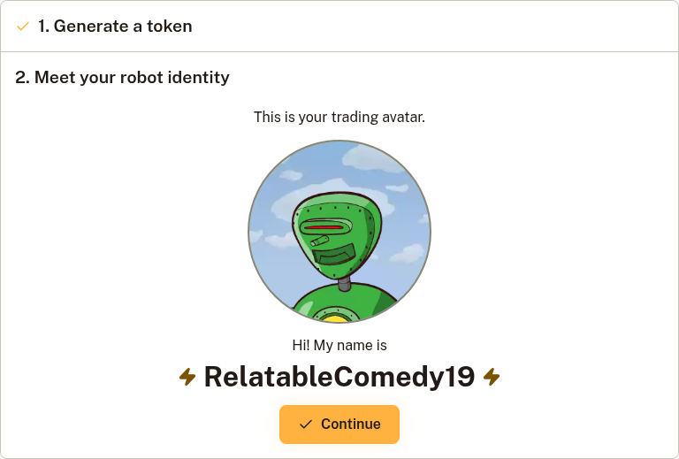
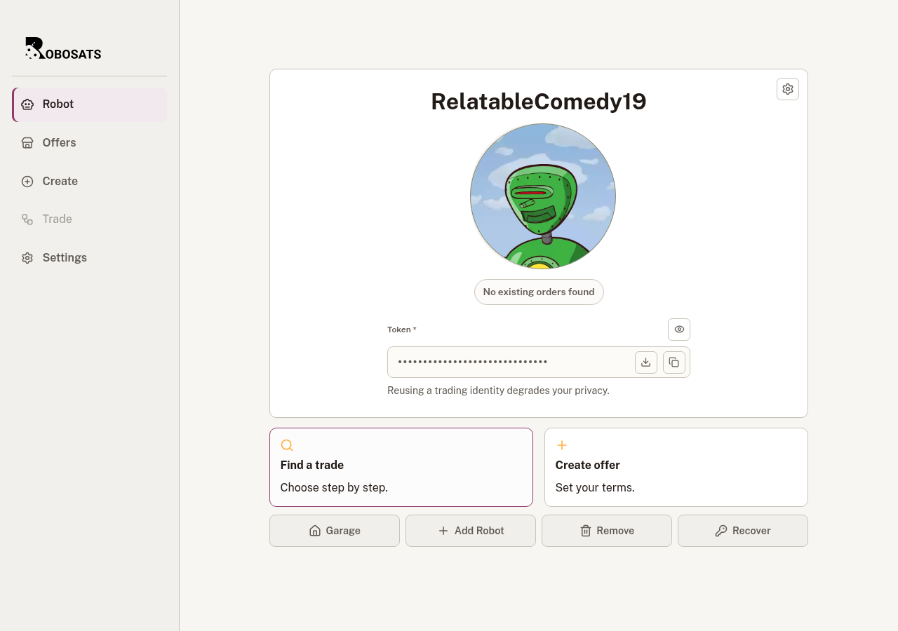
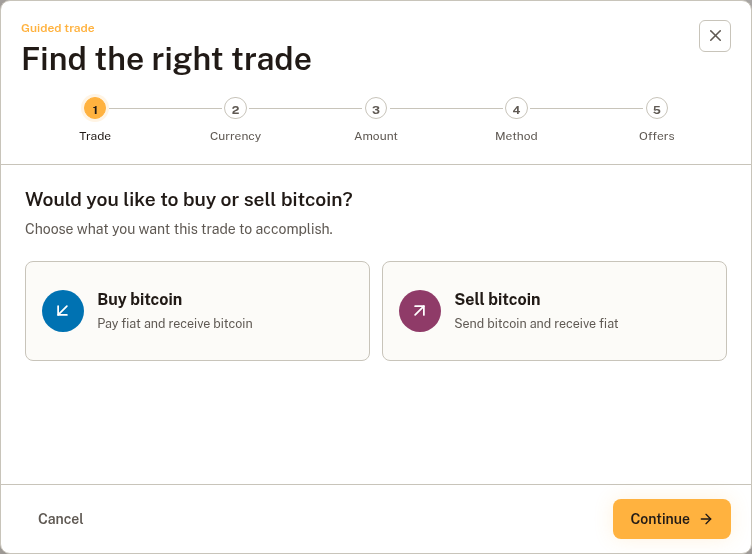
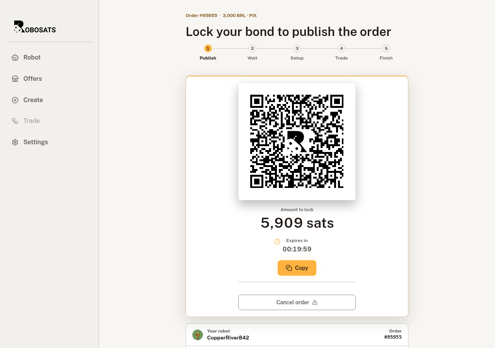
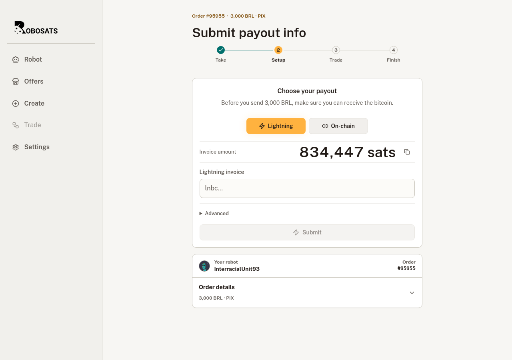
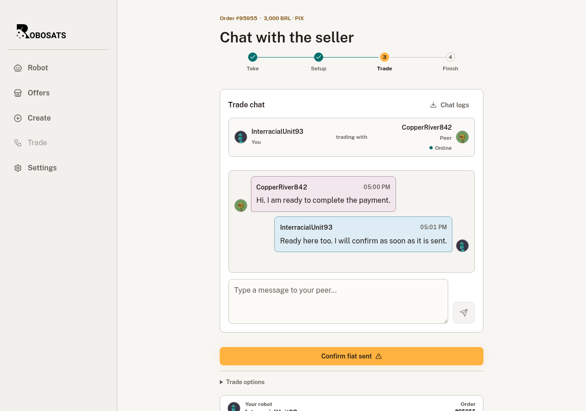
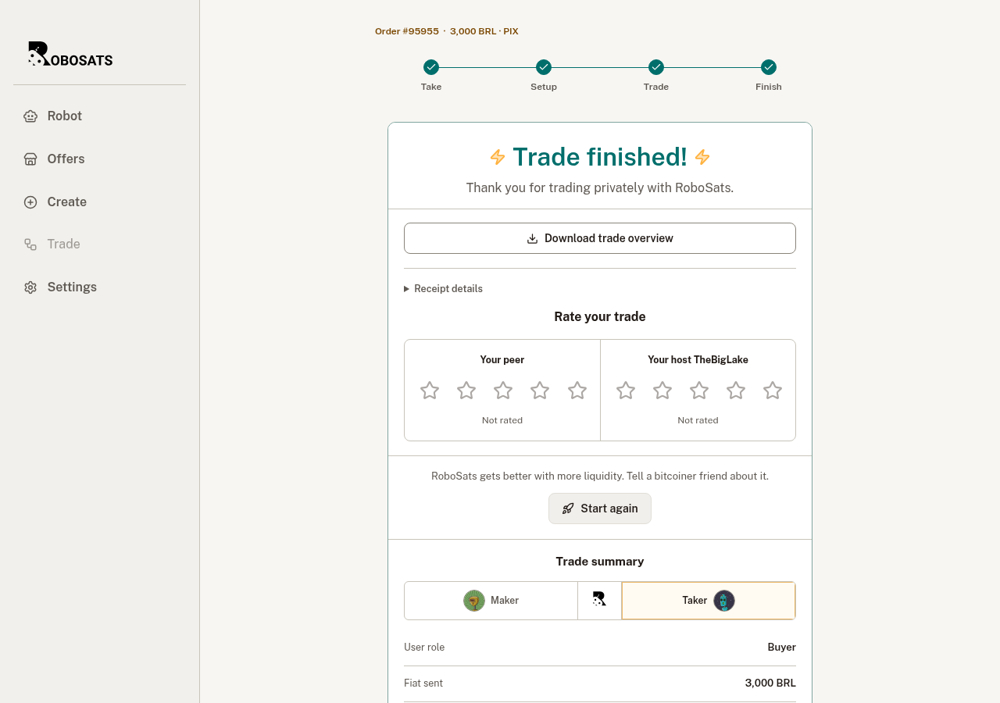

# Standard Garage user guide

The Standard Garage is the simplest way to make one RoboSats trade at a time. It gives you one private robot identity, keeps its token on your device, and reconnects that identity to any order it has with a coordinator.

Use [Pro Mode](pro-mode-guide.md) instead when you need several independent robots and want to monitor their trades together.

## Before you start

Have these ready:

- A private place to save the robot token.
- A Lightning wallet that can pay or receive the amounts shown by the trade.
- A payment method you can use promptly.
- Tor Browser for the web client, or an installed RoboSats Exp. app with its Tor connection ready.

> **Never share a robot token.** It controls the robot, its private communication keys, and its coordinator orders. RoboSats support will never need it.

## 1. Create a robot

Open **Robot** and select **Generate token**.

The token is created on your device. It is not a username or a password that a coordinator can reset.

## 2. Back up the robot token

Download the JSON backup or copy the token into a private password manager. Keep at least one backup away from the device you are trading on.

Select **Continue** only after the backup is safe.

If you lose the token, nobody can recreate the robot for you. If someone else gets it, they can control the same identity.

## 3. Meet your robot

The client derives a robot avatar, nickname, Nostr key, and encrypted chat identity from the token.

Select **Continue** to enter the Garage. From here you can find a matching public offer, create your own offer, back up the token again, or recover another robot.

The initial coordinator check can take longer over Tor. You can continue using the client while a background check is in progress.

## 4. Find a trade or create an offer

Select **Find a trade** for the guided flow. It asks:

1. Whether you want to buy or sell bitcoin.
2. The fiat currency.
3. The exact fiat amount.
4. The payment method.
5. Whether to take a matching offer or publish your own terms.

You can also:

- Open **Offers** to browse the full public orderbook.
- Open **Create** when you already know the terms you want.

Before continuing, verify the direction:

- **Buy bitcoin:** you send fiat and receive bitcoin over Lightning.
- **Sell bitcoin:** you lock bitcoin in escrow and receive fiat.

## 5. Review the order and lock the bond

Review the amount, premium, payment method, coordinator, bond, and expiry. The client then displays the Lightning invoice required for the bond.

The bond discourages abandoned trades:

- A maker locks a bond before an offer becomes public.
- A taker locks a bond after selecting a public offer.
- A cooperative trade returns both bonds.

Keep the trade screen open until the payment is detected. A paid Lightning invoice can take a little time to be reflected over Tor.

## 6. Complete your side of setup

The next action depends on your role.

| Role | What you provide | What happens next |
| --- | --- | --- |
| Buyer | A Lightning invoice for the bitcoin payout | Wait for the seller to lock the trade amount in escrow |
| Seller | The trade amount in a Lightning escrow invoice | Wait for the buyer to submit a payout invoice |

Check the displayed amount carefully. Do not reuse an expired invoice.

## 7. Use encrypted chat and exchange fiat

Once setup is complete, the private trade chat opens.

Use chat to agree on the payment details. Then:

- **Buyer:** send the fiat payment and select **Confirm fiat sent** only after it has actually been sent.
- **Seller:** verify the fiat payment in the receiving account. Release the escrow only after the funds are final and usable.

Do not rely on screenshots, email notices, or a message from the peer as proof of payment. Check the payment account itself.

For face-to-face cash trades, share the exact meeting point only in encrypted chat.

## 8. Finish the trade

After the seller releases escrow, the client routes the Lightning payout and shows the completed trade screen.

From here you can:

- Download the trade overview.
- Rate the peer and coordinator.
- Start again with a fresh robot.

A fresh robot gives stronger separation between trades. Reusing one robot lets coordinators or peers link activity belonging to that same identity.

## Recover an existing robot

1. Open **Robot**.
2. Select **Recover**, or expand **Recover with existing token** during setup.
3. Enter the exact robot token.
4. Continue to load the same identity.

Recovery recreates the robot's local cryptographic identity. The client then asks coordinators about any order belonging to that robot, so a slow or offline coordinator can delay the status update.

## Safety checklist

- Back up the token before funding a bond or escrow.
- Verify the buy/sell direction and fiat amount.
- Use a Lightning invoice with the amount shown by the client.
- Keep all trade communication in the encrypted chat.
- Never confirm fiat from a screenshot alone.
- Use the dispute statement inside the trade when coordinator help is required.
- Prefer a new robot after the trade is complete.

## Further reading

- [RoboSats Quick Start](https://robosats.org/docs/quick-start/)
- [RoboSats robot identities](https://robosats.org/docs/robots/)
- [RoboSats trade pipeline](https://robosats.org/docs/trade-pipeline/)
- [RoboSats fidelity bonds](https://robosats.org/docs/bonds/)
